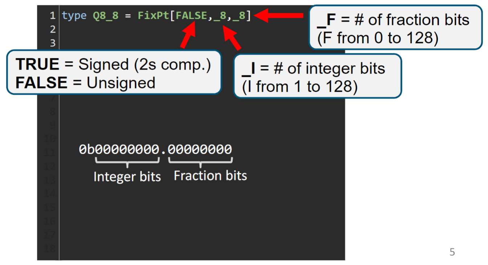

# Loading data from csv files in Spatial
This repository contains code to explain how to use csv files to load data into [Spatial](https://github.com/stanford-ppl/spatial).

## Syntax
### Load
You can use the `loadCSV2D` or `loadCSV1D` function to load a matrix or a vector from a csv file respectively. This loaded matrix or vector can be then used to initialize your off-chip DRAM.
```scala
val A_host = loadCSV2D[T](s"$DATA/mat.csv")
val A_dram = DRAM[T](3,2)
setMem(A_dram, A_host)
```
For the location of the csv file, You can either:
* Specify the absolute location of the csv file. If you run the following command in the directory that contains the csv file, you can get the absolute address of your csv file.
    ```bash
    cd <Folder_with_the_CSV>
    pwd # This will give you the absolute address of the directory
    ```
* Use `$DATA` as shown in the example code snippet above and set where the `$DATA` is pointing to when running the test. In this case, your run command will look like:
    ```bash
    TEST_DATA_HOME=<Absolute_Address_of_Data_Folder> sbt -Dtest.CS217=true "; testOnly <appname>" 
    ```
    
### Store
Similarly, you can use `writeCSV2D` or `writeCSV1D` to load the contents in DRAM out to the output csv file. When getting the content from a 2D DRAM, you can use `getMatrix` and for a 1D DRAM, you can use `getMem`.
```scala
val a_mat = getMatrix(A_dram)
printMatrix(a_mat)
writeCSV2D(a_mat, s"$DATA/output.csv")
```
For the location of the csv file, it is the same as the case for loading.

## Data type: Fixed Point
**The `loadCSV` and `writeCSV` both only works for Fixed Point data type.**

### For those who are not familiar with Fixed Point ([ref](https://www.analog.com/en/resources/technical-articles/fixedpoint-vs-floatingpoint-dsp.html))
The term ‘fixed point’ refers to the corresponding manner in which numbers are represented, with a fixed number of digits after, and sometimes before, the decimal point. With floating-point representation, the placement of the decimal point can ‘float’ relative to the significant digits of the number. For example, a fixed-point representation with a uniform decimal point placement convention can represent the numbers 123.45, 1234.56, 12345.67, etc, whereas a floating-point representation could in addition represent 1.234567, 123456.7, 0.00001234567, 1234567000000000, etc. As such, floating point can support a much wider range of values than fixed point, with the ability to represent very small numbers and very large numbers.

With fixed-point notation, the gaps between adjacent numbers always equal a value of one, whereas in floating-point notation, gaps between adjacent numbers are not uniformly spaced – the gap between any two numbers is approximately ten million times smaller than the value of the numbers (ANSI/IEEE Std. 754 standard format), with large gaps between large numbers and small gaps between small numbers.

Each of them has its own pros and cons, so people usually choose whith data type to use depending on the application requirements.
| Pro/Con  | Fixed-Point | Floating-Point |
-----------|--------------|-------|
| Pros     | Deterministic precision, simple hardware implementation, efficient for certain applications, no rounding errors | Wide range, automatic scaling, standardization, dynamic precision
| Cons     | Limited range, requires manual scaling, less flexibility | Complex hardware implementation, rounding errors, less predictable precision, resource-intensive

## Fixed Point in Spatial
In Spatial, you can define the fixed point type you will use by specifying:
* Signed / Unsigned
* Number of Integer Bits
* Number of Fraction Bits



(ref: Lecture3 slides)

### Explain How Fixed Points work with an Spatial Example
Some might have been confused because when you load in a file of real values the values that are actually stored in the DRAM is slightly different from the value in the csv file. This is because there is a specific range and precision the fixed point datatype you are using can express.

Let's see an example fixed point data type that used 16 bits each for the integer and fraction bits.
```scala
type T = FixPt[TRUE,_16,_16]
```

#### **Range**
Because we are using 16 bits to express the integer part and it is singed, the range of the integer part is $-2^{15} (= -32768)$ ~ $2^{15}-1 (= 32767)$. Therefore, this data type can express values between -32768 and 32767.XXX.

#### **Precision**

Since we are using 16 bits for the fractional part, the smallest gap between two values is `0b0.0000000000000001` = $2^{-16}$ = $\frac{1}{65536}$ = $0.0000152587890625$. 

This implies three things:
* **The reason why values in DRAM maynot be identical to the values in the csv file**:If the value is not exactly representable with 16 fractional bits, it will be represented to the closest value that can be expressed using the 16 fractional bits.
* **Bound of the error**: The error between your actual value in the csv file and the value casted to the given fixed point type will be always smaller than $0.0000152587890625$.
* **Why Overflow happens**: As there is a limited range it can express, if the value goes outside the range, overflow will happen, leading to a value that you haven't expected.

The `data/mat.csv` file contains some representative values that show these cases:
| Value in CSV file | Value in Spatial's DRAM | Explanation |
|-------------------|-------------------------|-------------|
| 1.125     | 1.125     | The fractional part can be exactly expressed using 16 bits (`0b1.001`), so the value will be the same.
| 1.875     | 1.875     | The fractional part can be exactly expressed using 16 bits (`0b1.111`), so the value will be the same.
| 0.03125   | 0.03125   | The fractional part can be exactly expressed using 16 bits (`0b0.00001`), so the value will be the same.
| 0.015625  | 0.015625  | The fractional part can be exactly expressed using 16 bits (`0b0.000001`), so the value will be the same.
| 0.03126   | 0.03125   | The fractional part cannot be exactly expressed using 16 bits. It is between `0b0.00001`(=0.03125) and `0b0.0000100000000001`(=0.0312652587890625), so the value will be expressed to the closest value that can be expressed with 16 fractional bits, which will be `0b0.00001`(=0.03125).
| 0.015624  | 0.0156097412109375        | The fractional part cannot be exactly expressed using 16 bits. It is between `0b0.0000001111111111`(=0.0156097412109375) and `0b0.000001`(=0.015625), so the value will be expressed to the closest value that can be expressed with 16 fractional bits, which will be `0b0.0000001111111111`(=0.0156097412109375).
| -32768    | -32768    | As this is within the range the fixed point can express, there is no overflow. This will be the smallest value you can express in this data type.
| 32767.015624 | 32767.0156097412109375 | The value is casted to the closest value that can be expressed with 16 fractional bits. This also does not cause overflow as the data type can express upto `0b0111111111111111.1111111111111111`(=32767.9999847412109375).
| -32768.015624| 32767.9843902587890625 | This will result in overflow as the value is smaller than -32768, which is outside of the range this data type can express.
| 32768.015624 | -32767.9843902587890625| This will also result in overflow as the value is larger than 32767.9999847412109375, which is outside of the range this data type can express.


## For the Project:
* If your project requires reading in real numbers fron csv files, try to look at the values you have in your files and decide what will be the proper range and precision you need.
* You can use this repository to convert your data to a value that is casted to a given fixed point data type and use that to calculate the gold for your application. The `mat.csv` file contains the numbers that I initially had, and the `output.csv` file holds the closest value that can be expressed in the given fixed point data type.
* As the calculation is also done in fixed point values, the output value can also be slightly different. For example, say that we want to do $0.5 * 0.015624 = 0.007812$:
    * In `Q16.16` fixed point, $0.5 * 0.0156097412109375 = 0.0078048706054688$
        * `QA.B` means that A bits are used for integer and B bits are used for the fractional part.

## End-to-end example Reference
An end-to-end example code that uses csv files to load inputs and save outputs can be found in [this repository](https://github.com/cs217/example_student_code)
* GEMV example: https://github.com/cs217/example_student_code/blob/master/src/test/scala/GEMV.scala
    * loadCSV1D
    * writeCSV1D
    * getMem
* GEMM example: https://github.com/cs217/example_student_code/blob/master/src/test/scala/GEMM.scala
    * loadCSV2D
    * writeCSV2D
    * getMatrix